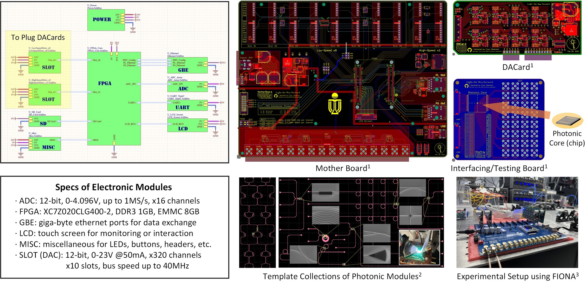
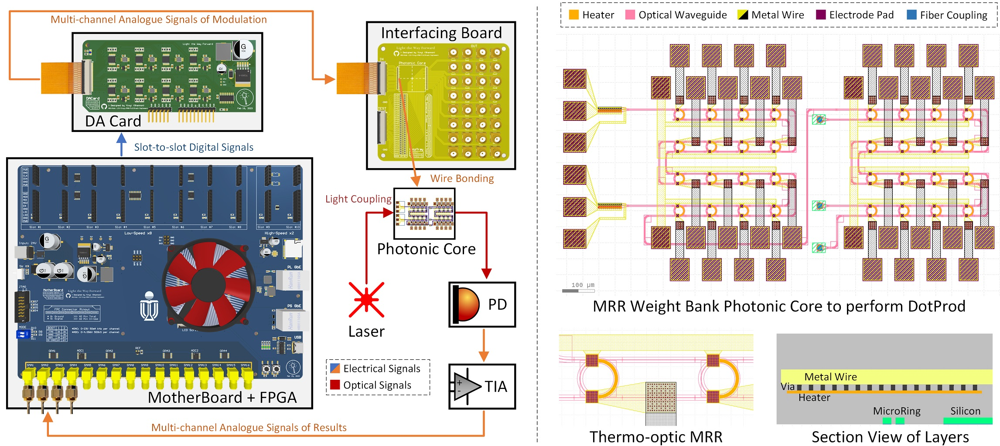

# FIONA-Hardware: Rapid Prototyping Template

 

🎉Welcome to the **FIONA Hardware** repository!   
🎯This sub-project is an integral part of the [FIONA-Toolchain](https://github.com/hkust-fiona/) and aims to provide a convenient and efficient solution for researchers to set up their real photonic computing systems. In this repository, we offer a rapid prototyping template specifically designed to facilitate the establishment of your testing environment, which includes:

1. **Mother Board:** It provides proper driven power, the signal bus towards slots of DAC and ADC arrays, and the IO pins for all the peripheral communications.
2. **DA Card:** Therre are 10 DAC slots on the Mother Board. Each slot can hold one DA Card. Each card has 32 output channels in a form of FPC connectors.
3. **Interfacing/Test Board:** For wire bonding with the photonic chip or cross-connector conversion for testing. It also serves DAC-ADC loopback test.

🛠️Since it is primarily designed for academic use, we have designed all electronic modules to be decoupled from each other, allowing for painless customization: 

- **Cross-module** interfaces are maximally devised in a pluggable way, except for the integrity-sensitive ones. Changes in the inter-module connectivity of the system architecture in the simulator correspond to handily unplug-and-reconnect the modules' topology.
- **Intra-module** customization is also allowed. It just requires unplug-and-replace your dedicated design by following the protocols of cross-module interfaces.

## Quickstarts for Device-Testing Users
📋The checklist of required components is shown as follows: 

|**Component**|**Specifications**|
|---|---|
|Power Supply|DC-5.5*2.1, 12~24V, 120+Watts|
|FPC Connector|40 pins, 0.5mm spanning, 30+mA|
|SMA Connector|SMA-Male (depend on your pair)|
|FPGA Board|OpenEdv FPGA-Core ZYNQ-7020|
|Ethernet Cable|RJ-45 Gigabyte Cable Cat5/6/7|
|USB Cable|Type-C USB Cable for Serial Port|
|Micro-SD Card|Recommend 8GB or above|

🚀We also demonstrate a case study called *LightRocket* in our paper, which has included a detailed figure showcasing inter-module connections for reference. As for the design of photonic modules, please refer to the sibling repository: [FIONA-Photonic](https://github.com/hkust-fiona/fiona-photonic).

## Customizations by Developers
🪄The development environment is based on [Altium Designer 2023](https://www.altium.com/altium-designer). After installation, you can directly open the workspace `FIONA-Workspace.DsnWrk`, which will automatically load all the board projects.

|**Files / Dirs**|**Notes**|
|---|---|
|`src/`|the directories that store the source files of the projects|
|`fab/`|the directories that store the files for foundry to fab|
|`*.SchDoc`|the files of circuit schematics|
|`*.PcbDoc`|the files of printed-circuit board layouts|
|`*.Cam`|the files for manufacturing|
|`Pick Place*.csv`|the files that store the pick-place position for SMT|

## Citations
🎓Please cite the following paper if you find this work useful:

> Yinyi Liu, Bohan Hu, Zhenguo Liu, Peiyu Chen, Linfeng Du, Jiaqi Liu, Xianbin Li, Wei Zhang, Jiang Xu. **FIONA: Photonic-Electronic Co-Simulation Framework and Transferable Prototyping for Photonic Accelerator.** In *2023 IEEE/ACM International Conference on Computer-Aided Design (ICCAD).* IEEE, 2023.

## Acknowledgements
❤️I would like to express my sincere gratitude and appreciation to several organizations for their invaluable contributions to my work. Without their support, this project would not have been possible:

|**Organizations**|**Supports**|
|---|---|
|[University Grants Committee (Hong Kong)](https://www.ugc.edu.hk/eng/ugc/index.html)|Research Funds|
|Guangzhou-HKUST(GZ) Joint Funding Program|Research Funds|
|[Altium Designer](https://www.altium.com/altium-designer)|Academic License|
|[OpenEdv (正点原子)](http://www.openedv.com/docs/index.html)|References and Tutorials|

